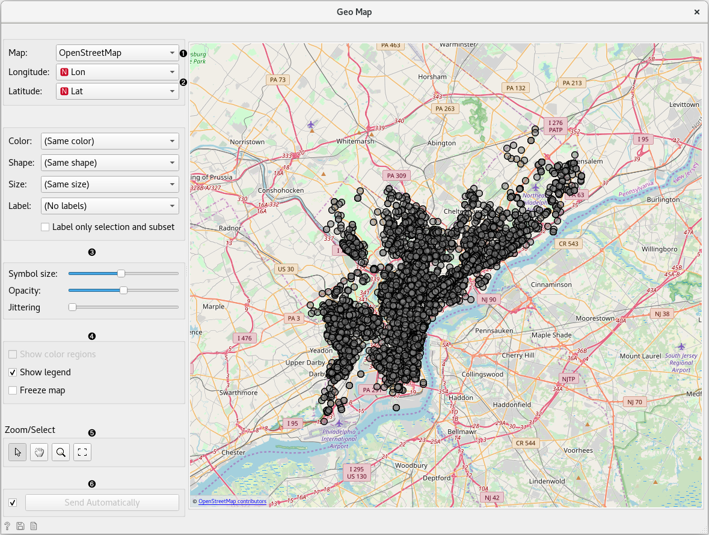

Geo Map
=======

Show data points on a world map.

**Inputs**
-  Data: Data set.
-  Data Subset: A subset of instances from the input data set.
-  Learner: A learning algorithm (classification or regression).

**Outputs**
-  Selected Data: A subset of instances that the user has manually selected from the map.
-  Data: Data set with an appended meta attribute specifying selected and unselected data.

**Geo Map** widget maps geo-spatial data on a world map. It only works on data sets containing latitude and longitude variables. It also enables class predictions when a learner is provided on the input.

 

1. Define map properties:

   - Set the type of *map*: Black and White, [OpenStreetMap](http://www.openstreetmap.org), Topographic, Satellite, Print, Light, Dark, Railyways and Watercolor.
   - Set latitude and longitude attributes, if the widget didn't recognize them automatically. Latitude values should be between -90(S) and 90(N) and longitude values between -180(W) and 180(E).

2. Overlay:

   - Set the target (class) for predictive mapping. A learner has to be provided on the input. The classifier is trained on latitude and longitude pairs only (i.e. it maps lat/lon pairs to the selected attribute).

3. Set point parameters:

   - *Color*: color of data points by attribute values
   - *Label*: label data points with an attribute (available when zoomed in)
   - *Shape*: shape of data points by attribute (available when zoomed in)
   - *Size*: size of data points by attribute
   - Opacity: set transparency of data points
   - Symbol size: size of data points (small to large)
   - Jittering: disperse overlaid data points
   - Cluster points: cluster neighboring points with [naive greedy clustering](https://github.com/Leaflet/Leaflet.markercluster) (available when less than 600 points are in view)

4. If *Send Selection Automatically* is ticked, changes are communicated automatically. Alternatively, click *Send Selection*. *Save image* saves the image to your computer in a .svg or .png format.

*Note:* To select a subset of points from the map, hold Shift and draw a rectangle around the point you want to output.

Examples
--------

In the first example we will model class predictions on a map. We will use *philadelphia-crime* data set, load it with **File** widget and connect it to **Map**. We can already observe the mapped points in Map. Now, we connect **Tree** to Map and set target variable to Type. This will display the predicted type of crime for a specific region of Philadelphia city (each region will be colored with a corresponding color code, explained in a legend on the right).

The second example uses [global-airports.csv](https://raw.githubusercontent.com/ajdapretnar/datasets/master/data/global_airports.csv) data. Say we somehow want to predict the altitude of the area based soley on the latitude and longitude. We again load the data with **File** widget and connect it to Map. Then we use a regressor, say, **kNN** and connect it to Map as well. Now we set target to altitude and use Black and White map type. The model guessed the Himalaya, but mades some errors elsewhere.

